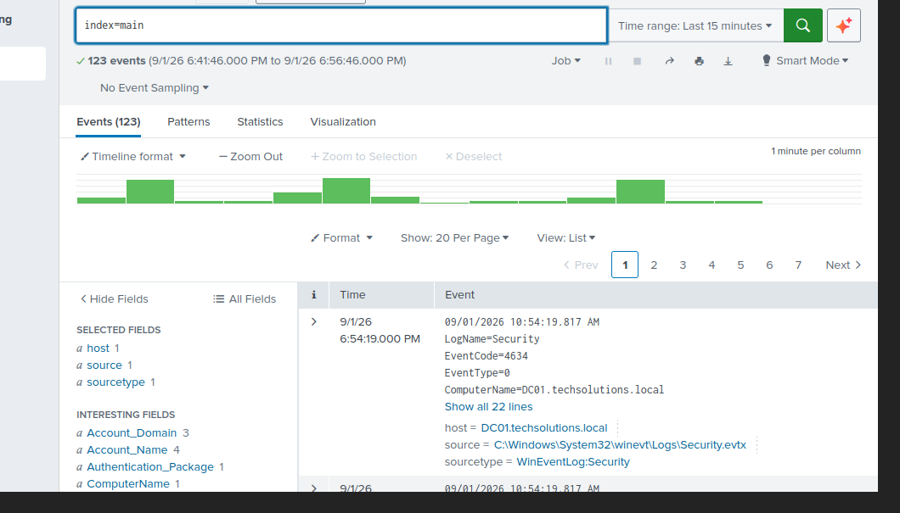
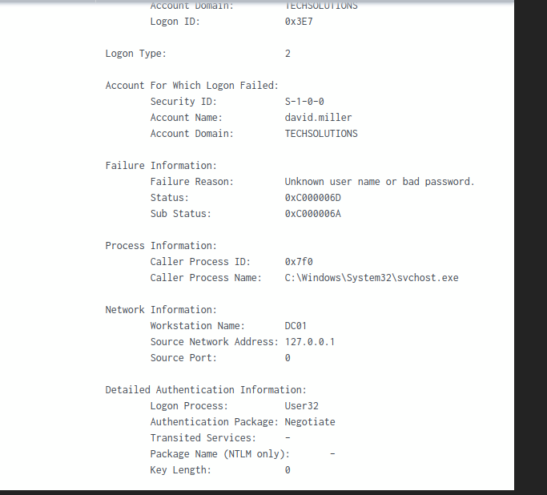
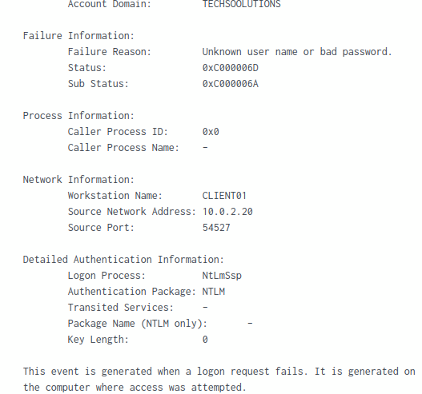
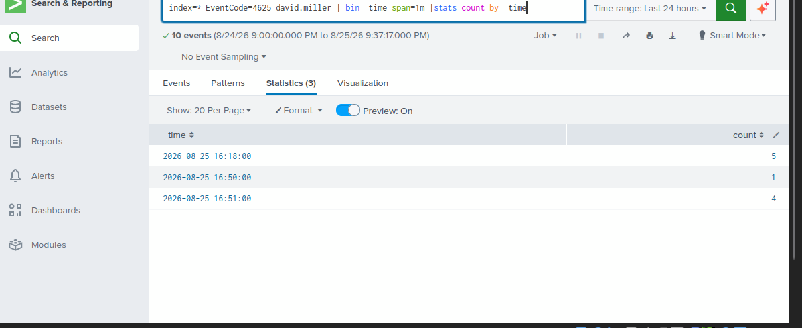
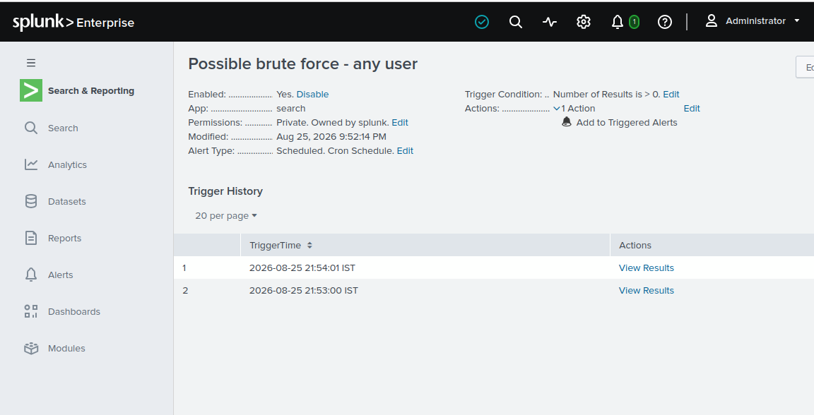

# SOC Detection Lab

Hands-on SOC lab focused on Windows event monitoring, threat detection, alerting and security investigation using Splunk Enterprise.

## Objective

The objective of this lab is to simulate a basic Security Operations Center workflow:

    Windows Endpoint
          ↓
    Windows Security Events
          ↓
    Splunk Universal Forwarder
          ↓
    Splunk Enterprise
          ↓
    SPL Detection
          ↓
    Alert
          ↓
    Security Investigation

The lab focuses on detecting repeated failed authentication attempts and investigating the resulting Windows Security Event Logs.

## Lab Environment

| Component | Technology |
|---|---|
| Domain Controller | Windows Server 2022 |
| Endpoint | Windows 11 |
| SIEM | Splunk Enterprise 10.4.2 |
| Log Collection | Splunk Universal Forwarder 10.4.2 |
| Directory Services | Active Directory |
| Log Source | Windows Security Event Logs |
| Virtualization | VirtualBox |
| SIEM Server | Ubuntu 24.04 |

## Lab Architecture

    Windows Server DC01
    ├── Active Directory
    ├── DNS
    └── Windows Security Event Logs
                │
                │ Event ID 4625
                ▼
    Splunk Universal Forwarder
                │
                │ TCP 9997
                ▼
    Splunk Enterprise
    ├── Search
    ├── Detection
    ├── Alerting
    └── Investigation

    Windows 11 CLIENT01
    └── Generates failed authentication attempts

## Log Collection

Windows Security Event Logs are collected using the Splunk Universal Forwarder.

The forwarder sends events to Splunk Enterprise over TCP port `9997`.

The monitored Windows Security log is configured as:

    [WinEventLog://Security]
    disabled = 0
    index = main

This allows Windows security events to be forwarded into Splunk for analysis.

## Detection Scenario

### Failed Authentication / Brute Force

The detection scenario simulates repeated failed authentication attempts against a Windows account.

The primary Windows event analyzed is:

**Event ID 4625 — Failed Logon**

Event ID 4625 provides useful information for security investigations, including:

- Account name
- Failure reason
- Workstation name
- Source network address
- Source port
- Authentication package
- Timestamp

Example event observed in the lab:

    Account: david.miller
    Failure Reason: Unknown user name or bad password
    Workstation Name: CLIENT01
    Source Network Address: 10.0.2.20
    Authentication Package: NTLM

## Detection Logic

The detection groups failed logon events into one-minute windows and identifies accounts with five or more failures.

    index=* EventCode=4625
    | bin _time span=1m
    | stats count by Account_Name, _time
    | where count >= 5

### How the Detection Works

    Event ID 4625
          ↓
    Group events into 1-minute windows
          ↓
    Count failed logins per account
          ↓
    5 or more failures
          ↓
    Detection triggers

## Alerting

The detection was configured as a Splunk alert:

**Possible brute force - any user**

The alert identifies repeated failed authentication attempts without relying on a single hard-coded username.

## Remote Authentication Test

A network authentication test was performed from `CLIENT01` to `DC01` to generate realistic failed authentication events.

Example:

    net use \\DC01\IPC$ /delete
    net use \\DC01\IPC$ /user:TECHSOLUTIONS\david.miller *

A failed password generated Windows Security Event ID 4625 on the Domain Controller.

The resulting event showed:

    Workstation Name: CLIENT01
    Source Network Address: 10.0.2.20
    Failure Reason: Unknown user name or bad password

This demonstrated the flow from a failed authentication attempt to SIEM visibility.

## Investigation Workflow

When the detection triggers, the event is investigated by reviewing:

1. The affected account
2. The failure reason
3. The source workstation
4. The source IP address
5. The source port
6. The authentication package
7. The frequency of failed attempts

The purpose is to determine whether the activity is consistent with normal user behavior, a configuration problem, or potentially malicious activity.

Repeated failed authentication attempts may be associated with:

- Password guessing
- Brute-force attacks
- Incorrect credentials
- Stored credentials
- Misconfigured applications or services
- User authentication errors

The alert itself does not automatically prove malicious activity. Further investigation is required.

## Investigation Results

The lab successfully demonstrated the following workflow:

    Failed authentication
            ↓
    Windows Event ID 4625
            ↓
    Splunk Universal Forwarder
            ↓
    Splunk Enterprise
            ↓
    SPL Detection
            ↓
    Splunk Alert
            ↓
    Security Investigation

The detection was tested with multiple failed authentication attempts and successfully identified accounts exceeding the configured threshold.

## Screenshots

### Splunk Events

### Event ID 4625 Investigation

### Remote Authentication Failure

### Failed Logins Time Window

### Brute Force Detection Triggered

## Detection File

The SPL detection used in this project is available here:

[`detections/brute-force.spl`](detections/brute-force.spl)

## Skills Demonstrated

- Splunk Enterprise
- Splunk Universal Forwarder
- SPL
- SIEM monitoring
- Windows Event Logs
- Event ID 4625 analysis
- Detection engineering
- Security alerting
- Authentication investigation
- Log analysis
- Windows Server
- Active Directory
- Network authentication
- Security investigation

## Limitations

This project was created in a controlled home lab environment.

The brute-force detection uses a simple threshold of five failed logons within one minute.

A production SOC detection would normally use additional context such as:

- Source IP reputation
- User behavior
- Account privileges
- Host criticality
- Successful logons following failures
- Baseline behavior
- Correlation with other security events

## Future Improvements

- Detect successful logons following multiple failures
- Correlate Event IDs 4625 and 4624
- Add source IP-based detections
- Add additional Windows security detections
- Integrate Sysmon
- Create a Splunk investigation dashboard
- Add additional SOC detection rules

## Project Structure

    soc-detection-lab/
    │
    ├── README.md
    │
    ├── detections/
    │   └── brute-force.spl
    │
    └── screenshots/
        ├── splunk-events.png
        ├── event-4625-investigation.png
        ├── remote-authentication-failure.png
        ├── failed-logins-time-window.png
        └── brute-force-detection-triggered.png

## Disclaimer

This project was created in an isolated virtual lab environment for educational and portfolio purposes.
